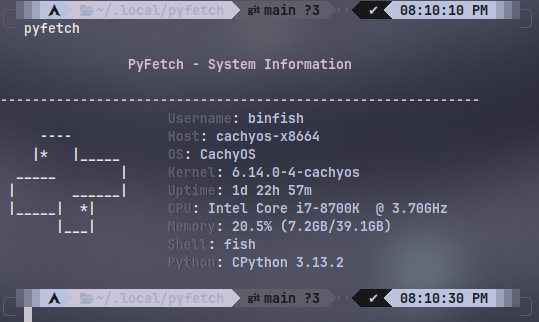
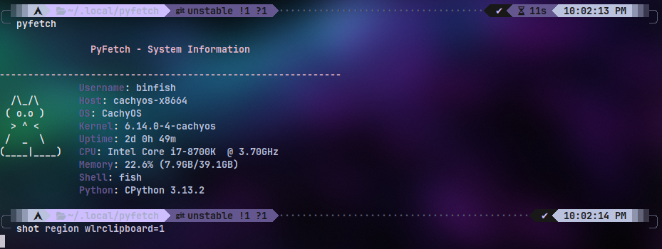
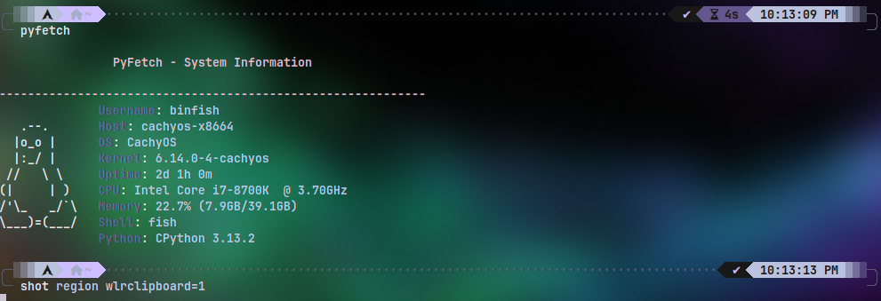
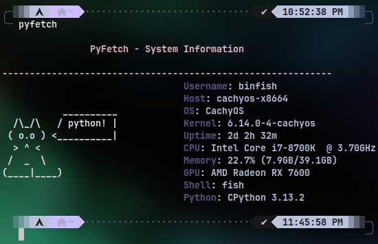

# PYFETCH
a python a lightweight system-fetch tool that fully python independent from other LANGS LIKE JAVA, c, ETC. ANYTHING PYTHON.

# TREE

- [INSTALL](https://github.com/binarylinuxx/pyfetch#install)
  - [ARCH LINUX BASED](https://github.com/binarylinuxx/pyfetch#for-arch-linux-based)
  - [OTHER DISTROS](https://github.com/binarylinuxx/pyfetch#other-linux-distros)
- [SCREENS](https://github.com/binarylinuxx/pyfetch#screens)
- [CONFIG](https://github.com/binarylinuxx/pyfetch#config)
  - [CUSTOM ASCII](https://github.com/binarylinuxx/pyfetch#and-what-about-custom-ascii-arts)

# INSTALL
MAKE SURE **python-colorama**, **python-psutil**, **pciutils** ARE INSTALLED.

# FOR ARCH-LINUX-BASED
```
git clone https://github.com/binarylinuxx/pyfetch
cd pyfetch
makepkg -si
```

 # OTHER LINUX DISTROS
```
git clone https://github.com/binarylinuxx/pyfetch
cd pyfetch
sudo make install
```

> [!NOTE]
> IM UPDATING MAKEFILE MORE THAN PKGBUILD SO IF YOU WANT ALWAYS ROLLING
> BETTER OPTION INSTALL WITH MAKE.

# SCREENS


# CONFIG
YOU CAN CONFIGURE AS YOU WANT IN **~/.config/pyfetch/config.ini** LIKE:
```
[display] #ENABLE OR DISABLE MODULES
show_host = true
show_os = true
show_kernel = true
show_uptime = true
show_cpu = true
show_memory = true
show_gpu = false
show_shell = true

[ascii] #HERE YOU CAN CHANGE COLOR OF OUTPUT LOGO AND IMPORT CUSTOM ASCII
art_style = pyfetch
color = blue

[format] #COLORS
info_prefix =
info_color = white
label_color = yellow
title_color = magenta
```

# AND WHAT ABOUT CUSTOM ASCII ARTS?

CURRENTLY 4 ASSETS READY FOR YOU:
---------------------------------

**CAT**


**TUX**


**PYTHON CAT**


**AND THE FAMILIAR PYTHON**


**CUSTOM**
ASCII WILL REQUIRE SOME PYTHON SKILLS TO EDIT THE SOURCES AND RECOMPIE EVERY TIME YOU ADDING NEW

> [!IMPORTANT]
> RECOMPILE PROCESS ONLY WITH **MAKE** PKGBUILD ARE FETCH CURRENT EXIST SETUP

GO TO YOUR DIR WITH CLONED pyfetch
EDIT: **pyfecth** MAIN CODE NOT THE CONFIG
FIND SECTION WITH FUNCTION **get_ascii_art**
```
def get_ascii_art(config):
    """Get ASCII art with perfect alignment"""
    style = config['ascii'].get('art_style', 'tux')
    custom_art = config['ascii'].get('custom_art', '').strip()
    
    if custom_art:
        return custom_art
    
    custom_path = config['ascii'].get('custom_art_path', '')
    if custom_path:
        try:
            with open(os.path.expanduser(custom_path), 'r') as f:
                return f.read().strip()
        except Exception as e:
            print(f"Error loading custom art: {e}", file=sys.stderr)
    
    # Built-in arts
    builtin_arts = {
        'tux': r"""
   .--.   
  |o_o |  
  |:_/ |  
 //   \ \ 
(|     | )
/'\_   _/`\
\___)=(___/""",
        'cat': r"""
  /\_/\  
 ( o.o ) 
  > ^ <  
 /  _  \ 
(____|____)""",
        'pyfetch': r"""
     ----    
    |*   |_____
  __|___       |
 |       ______|
 |_____|  *|   
       |___|""", #ENSURE PREVIUS ASCII BEFORE YOU CREATED END UP WITH "," SYMBOL
        'example': r""" #HERE IS NAME OF FUNCTION OF YOUR ASCII
        Hello! #FOR EXAMPLE HERE IM TYPED Hello! BUT YOU CAN ADD WHATEVER ASCII YOU WANT BUT DO NOT FORGET IT DESIGNED FOR SMALL ARTS
        """ #END OF FUNCTION OF YOUR ASCII
    }
    return builtin_arts.get(style, builtin_arts['tux'])
```

**RECOMPILE**
```
~/pyfetch/
$ sudo make install
```

AFTER YOU DEFINED YOUR NEW ASCII ARTS AND RECOMPILED GO AND EDIT **~/.config/pyfetch/config.ini** AND MAKE IT LOOK LIKE
```
[display]
show_host = true
show_os = true
show_kernel = true
show_uptime = true
show_cpu = true
show_memory = true
show_gpu = false
show_shell = true

[ascii]
art_style = NAME_OF_YOUR_OWN_ASCII
color = blue
art_width = 11

[format]
info_prefix =
info_color = white
label_color = yellow
title_color = magenta
```
NOW YOU CAN ENJOY YOUR CUSTOM ASCII YAY!
